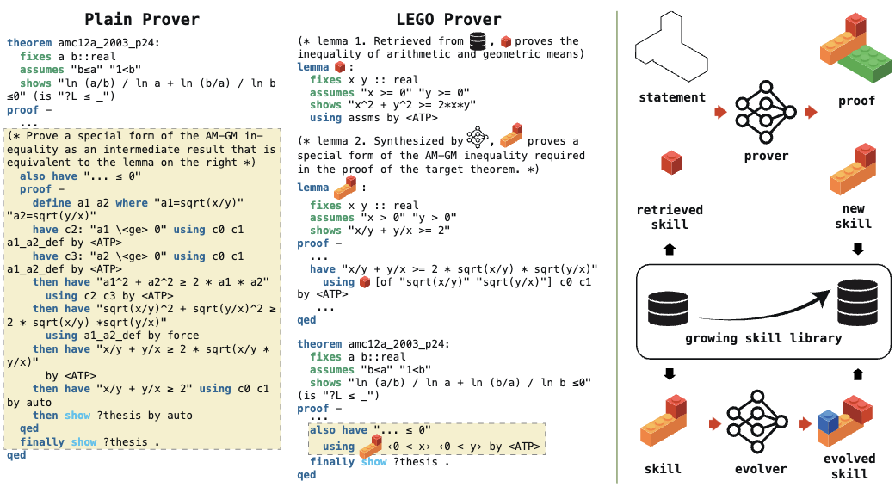

# LEGO-Prover: Neural Theorem Proving with Growing Libraries
<div align="center">

[[Arxiv]](https://arxiv.org/abs/2310.00656)
[[PDF]](https://arxiv.org/pdf/2310.00656.pdf)


[](https://github.com/wiio12/LEGO-Prover)
[](hhttps://github.com/wiio12/LEGO-Prover/blob/main/LICENSE)



</div>

We introduce LEGO-Prover, the first automated theorem prover powered by the LLM that constructs the proof in a block-by-block manner. Previous methods synthesize the proof sequentially, with each step building upon the previous proof step, and stocking all the proof code into one large proof block. LEGO-Prover tackles the problem of proving a theorem by first proving the sub-goal lemmas and then finalizing the problem using these lemmas. These lemmas can be retrieved from the skill library or newly constructed during the proving process. LEGO-Prover contains a prover and an evolver, which are bridged by the growing skill library. The prover takes the problem’s formal statement as input and retrieves skills to prompt the LLM in generating the modular proof, with the generated lemmas accumulated into the skill library. The evolver transforms the skills in the library for better generality, reusability, and complexity of the skills. On the miniF2F dataset, LEGO-Prover significantly outperforms previous approaches, achieving a pass rate of 57.0% and 50.0% on the miniF2F valid and test datasets, respectively. With a 6.75% absolute improvement on average. Moreover, the learned skill library contains over 20,000 skills encompassing many useful high-level lemmas broadly applicable to various problems. 

In this repo, we provide LEGO-Prover code. This codebase is under [MIT License](LICENSE).

# Installation
LEGO-Prover is only tested under Python 3.11.4, but with high possibility compatible with lower Python versions. We have tested the LEGO-Prover under Ubuntu 18.04. You need to follow the instructions bellow to install LEGO-Prover.

## Python Install
You could begin with cloning the project to local directory
```shell
git clone https://github.com/wiio12/LEGO-Prover.git
cd LEGO-Prover
pip install -e .
pip install protobuf==3.20.3
```
**Noet:** the pip might give error about incompatible versions for `protobuf` and `grpcio-tools`, but it works fine (at lease for me).

## PISA Install
[PISA](https://github.com/albertqjiang/Portal-to-ISAbelle) (Portal to ISAbelle) is a REPL wrapper for Isabelle theorem prover. LEGO-Prover utilize PISA to communicate with Isabelle theorem prover and verify the formal code. You should follow the instruction bellow to install PISA and Isabelle. **This process might be struggling**

1. **Scala configuration**
   
    Install SDKMAN
    ```shell
    cd ~
    curl -s "https://get.sdkman.io" | bash
    source .bashrc
    ```
    
    Install JAVA 11 and sbt
    ```shell
    sdk install java 11.0.11-open
    sdk install sbt
    ```

2. **Configure Isabelle**
    ```shell
    wget https://isabelle.in.tum.de/website-Isabelle2022/dist/Isabelle2022_linux.tar.gz
    tar -xzf Isabelle2022_linux.tar.gz
    export PATH="$PATH:$HOME/Isabelle2022/bin/"
    ```
    Try
    ```shell
    isabelle 
    ```
    to makes ure isabelle is properly installed.

3. **Update submodules**

    Go back to the repo directory and update PISA submodule
    ```shell
    cd LEGO-Prover
    git submodule init
    git submodule update
    ```

## OpenAI API Keys
This project require OpenAI API Keys to properly query the OpenAI LLMs. LEGO-Prover requires two types of models: standard GPT models (i.e. gpt-4, gpt-3.5-turbo) and embedding models (i.e. text-embedding-ada-002). Please make sure the API key provided have access to these models.

Please place your OpenAI API keys in the `openai_keys.py` file, formatted as follows:
```python
GPT_35_POOL = [
    ("sk-xxx", "org-xxx"),
    ("sk-xxx", None),      # if no organization id is required
]

GPT_4_POOL = [
    ("sk-xxx", "org-xxx"),
]
```
You could leave one of the pool empty if you only have GPT-4 keys or GPT-3.5 keys.

# Evaluation
You can run the LEGO-Prover with following command
```
python run_multiprocess.py 
```
The parameters are as follows:
- `resume`: whether to resume from the checkpoint.
- `data_split`: data split to use in the miniF2F dataset, choose from `valid` and `test`.
- `ckpt_dir`: path to the checkpoint directory
- `isabelle_path`: path to the Isabelle2022 installation. If you install the Isabelle in the default position, the path is usually `/home/your_name/Isabelle2022/`
- `model_name`: OpenAI large language model. choose from `gpt-3.5-turbo` and `gpt-4`
- `temperature`: temperature for sampling the LLM
- `num_prover`: number of prover process running in parallel.
- `num_evolver`: number of evolver process running in parallel.
- `num_attempts`: number of proving attempts for each problem in the dataset

**Note**: the Isabelle formal verifier requires enormous cpu memories and computations, so keeps the number of parallel process low if you don't have a beefy machine.


# Paper and Citation

If you find our work useful, please consider citing us!
```bibtex
@misc{xin2023legoprover,
      title={LEGO-Prover: Neural Theorem Proving with Growing Libraries}, 
      author={Huajian Xin and Haiming Wang and Chuanyang Zheng and Lin Li and Zhengying Liu and Qingxing Cao and Yinya Huang and Jing Xiong and Han Shi and Enze Xie and Jian Yin and Zhenguo Li and Xiaodan Liang and Heng Liao},
      year={2023},
      eprint={2310.00656},
      archivePrefix={arXiv},
      primaryClass={cs.AI}
}
```
